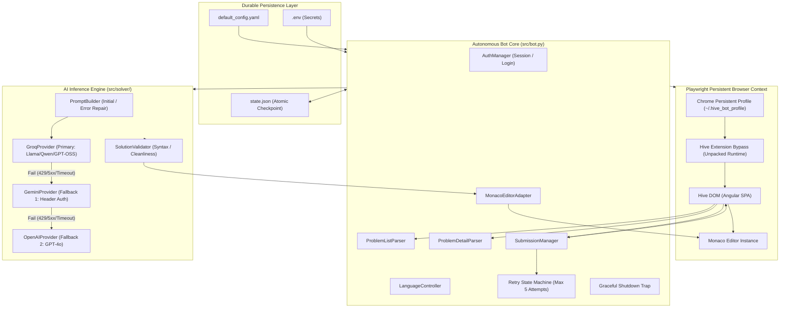
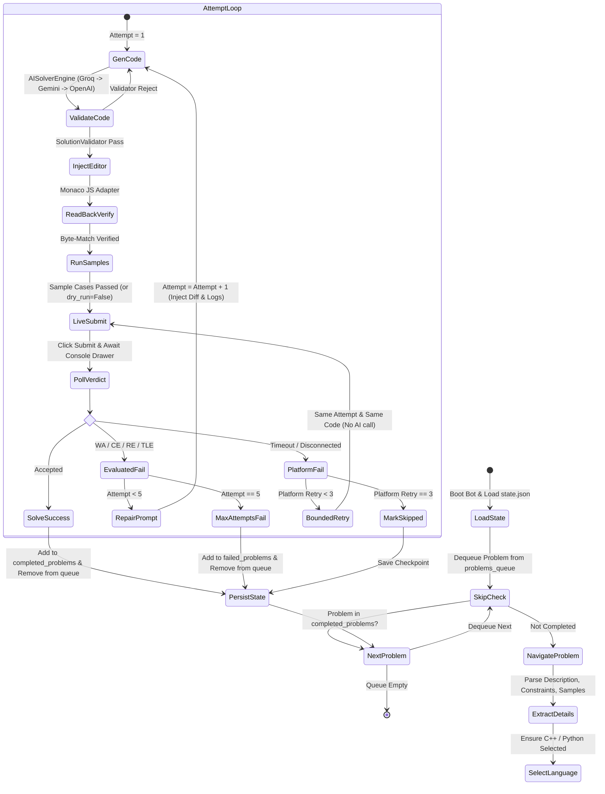

# Hive Autonomous Competitive Programming Bot (v1.0 Production Baseline)

> **A deterministic, resilient, and fully autonomous browser automation agent designed to extract competitive programming problems, synthesize optimal solutions across a multi-provider LLM cascade, control Monaco code editors, and manage live submissions with rigorous retry state-machine invariants.**

---

## Table of Contents
1. [System Overview & Architecture](#system-overview--architecture)
2. [Core Engineering Invariants & Principles](#core-engineering-invariants--principles)
3. [Component Breakdown](#component-breakdown)
4. [The Solve Loop & State-Machine Workflow](#the-solve-loop--state-machine-workflow)
5. [Empirical Platform Insights & Bypass Solutions](#empirical-platform-insights--bypass-solutions)
6. [Repository Structure](#repository-structure)
7. [Installation & Setup](#installation--setup)
8. [Configuration Guide](#configuration-guide)
9. [Operational Execution](#operational-execution)
10. [Verification, Testing & Hardening](#verification-testing--hardening)
11. [License & Security Notice](#license--security-notice)

---

## System Overview & Architecture

The Hive Automation Bot solves algorithmic programming contests on the Hive platform with zero human intervention. Unlike fragile DOM-scraping scripts, this system is engineered as an **enterprise-grade state-driven distributed robot**, separating raw browser protocol management from functional parsing, abstract model evaluation, and transactional state persistence.

### High-Level Architectural Pipeline



---

## Core Engineering Invariants & Principles

The bot is designed under strict systems-engineering constraints:

### 1. Separation of Concerns: $UI \ne Logic \ne API \ne Database$
* **Pure Functional Parsing**: DOM scraping and text extraction are decoupled from verdict evaluation. `SubmissionParser` and `ProblemDetailParser` operate on raw text and HTML structures, enabling 100% deterministic unit testing without requiring an active browser or network connection.
* **Abstract Inference Providers**: The AI solver pipeline treats LLMs as interchangeable inference backends. All provider implementations implement `BaseAIProvider` and map provider-specific error codes into uniform abstract failure classifications.
* **Transactional State Storage**: State writes are executed atomically using write-and-replace (`.tmp` $\rightarrow$ `.json`), preventing corruptions from process interruptions.

### 2. Dual-Domain Error Classification: Code Failures vs. Platform Failures
A fundamental bug in naive bots is treating platform glitches (timeouts, network hiccups, unparsed responses) as algorithmic failures. The Hive Bot strictly enforces:
* **Evaluated Code Failures** (`Wrong Answer`, `Compilation Error`, `Runtime Error`, `Time Limit Exceeded`):
  - Strictly increments the attempt counter toward `max_attempts` (default: 5).
  - Ingests compiler logs, diff outputs, and failed source code into an iterative **Prompt Repair Loop**.
* **Platform & Infrastructure Failures** (`TIMEOUT`, `DISCONNECTED`, `MISSING_RESULT`, `UNRECOGNIZED_VERDICT`):
  - **Never burns an AI attempt**.
  - Retains the current code intact in the editor.
  - Retries submission up to a bounded limit (`max_platform_retries: 3`), preserving LLM API quotas and attempt integrity.

### 3. Zero Model Strings in Source Code
* Model IDs (`openai/gpt-oss-120b`, `gemini-2.5-flash`, `gpt-4o-mini`) are strictly forbidden in Python application source code or test suites.
* Model strings are managed as configuration tokens in `config/default_config.yaml` and overridable via environment variables (`GROQ_MODEL`, `GEMINI_MODEL`, `OPENAI_MODEL`). Missing model definitions fail loudly at engine boot time (`ConfigError`).

### 4. Crash Recovery Across OS-Process Boundaries
* Every problem solved to `Accepted` is atomically recorded in `completed_problems` in `state.json` and pruned from `problems_queue`.
* If the bot process crashes or is killed by the OS, restarting the bot reads `state.json` and **skips all completed problems immediately** with:
  - Exactly 0 browser navigations
  - Exactly 0 AI inference calls
  - Exactly 0 duplicate submissions

### 5. Signal-Safe Graceful Shutdown Model
* To eliminate partial writes or in-flight submission ambiguities, OS signals (`SIGINT`, `SIGTERM`, `SIGBREAK`) only set an internal thread-safe `_shutdown_requested` flag.
* No asynchronous Playwright calls or event loop evaluations occur inside the raw OS signal callback.
* The main cooperative solve loop checks the shutdown flag at clean, safe boundaries (top of problem loop, between attempts, before submission), checkpoints durable state, and closes the browser context idempotently.

---

## Component Breakdown

### 1. Browser & Session Management (`src/browser/`)
* **`BrowserManager`**: Launches Playwright with a persistent Chromium user profile directory (`~/.hive_bot_profile`). Preserves session cookies, `localStorage` tokens, and browser state across runs.
* **`ExtensionChecker`**: Implements a 3-tier readiness gate:
  - *Tier 1*: Verifies extension existence and manifest validity in profile storage.
  - *Tier 2*: Confirms extension injection into the runtime execution context.
  - *Tier 3*: Validates that Hive's DOM blocker overlay (`mat-dialog-container`) is completely dismissed.

### 2. Authentication & Form Automation (`src/auth/`)
* **`Credentials`**: Strongly typed configuration dataclass. Overrides `__repr__` and `__str__` to mask passwords (`***`), preventing accidental credential leaks in logs or stack traces.
* **`AuthManager`**: Manages the Hive authentication lifecycle. Employs character-by-character keyboard typing with micro-delays (`page.keyboard.type`) rather than direct DOM property assignments, ensuring Angular's reactive form model receives native `input` and `change` events. Reuses existing authenticated sessions automatically via `localStorage` checks (`jwtToken`, `hive_username`).

### 3. Hive Platform Extraction & Submission (`src/hive/`)
* **`ProblemListParser`**: Navigates the contest root, scrolls dynamically, and categorizes problems into `Unsolved`, `Solved`, or `Attempted`.
* **`ProblemDetailParser`**: Extracts problem title, problem description HTML, memory/time constraints, input/output formats, and sample testcases. Supports unstructured fallback extraction if Hive changes layout markers.
* **`SubmissionManager` & `SubmissionParser`**: Orchestrates running sample testcases and live contest submissions. Monitors multiple DOM surfaces:
  - Inside the `.console` drawer: Heading verdicts (`Accepted`, `Wrong Answer`), score badges (`Score: 20 / 20`), and testcase tallies.
  - Inside Angular Material snackbars (`.mdc-snackbar`): Toast notification messages.

### 4. Monaco Editor Automation (`src/editor/`)
* **`MonacoEditorAdapter`**: Interacts directly with the Monaco Editor instance backing Hive's web IDE.
  - Executes evaluated JavaScript against `window.monaco.editor.getModels()` scoped to the editor's DOM container.
  - Performs **Read-Back Verification**: After setting code via `model.setValue()`, immediately reads back the buffer via `model.getValue()` and validates exact byte equality before allowing execution.
* **`LanguageController`**: Manages the language selection dropdown. Maps requested languages (e.g., `C++`, `Python`, `Java`) to Hive's DOM dropdown options and verifies that Monaco's editor model mode updates accordingly.

### 5. Multi-Provider AI Inference Engine (`src/solver/`)
* **`AISolverEngine`**: Dispatches requests through a prioritized fallback cascade:
  $$\text{Groq} \longrightarrow \text{Google Gemini} \longrightarrow \text{OpenAI}$$
  - Classifies errors into `AUTH_FAILURE`, `RATE_LIMIT` (429), `TIMEOUT`, `UNAVAILABLE` (5xx), `INVALID_RESPONSE`, and `INVALID_REQUEST` (400).
  - Transient faults automatically trigger fallback to the next provider; client-side formatting errors fail immediately without burning downstream quotas.
* **`GeminiProvider`**: Utilizes Google's REST API with **Header-Based Authentication** (`x-goog-api-key: ...`) rather than query parameters (`?key=...`), preventing credential leakage in proxy and client logs.
* **`SolutionValidator`**: Strips markdown code fences, removes conversational preambles/postambles, and enforces structural sanity (e.g., `main()` definition for C++/Java, statements for Python).
* **`PromptBuilder`**: Constructs structured instructions for both cold-start solving (Attempt 1) and error repair loops (Attempts 2–5).

### 6. State Persistence & Checkpointing (`src/state/`)
* **`StateManager`**: Manages serialization of `BotState`.
  - Atomic writing via staging `.tmp` files and `os.replace`.
  - Checkpoints queue state, completed problems, and failed problem diagnostics.

---

## The Solve Loop & State-Machine Workflow



---

## Empirical Platform Insights & Bypass Solutions

During reverse engineering and live testing on Hive, several non-trivial platform behaviors were identified and solved:

| Challenge | Root Cause | Engineering Solution |
| :--- | :--- | :--- |
| **Extension Blocker Dialog** | Hive displays a blocking modal dialog (`mat-dialog-container`) requiring the *Hive Extension Detector* Chrome extension. | Injected the unpacked extension via persistent user data directory (`user_data_dir`) and removed Playwright's default `--disable-extensions` argument. |
| **Monaco Typing Latency** | Emulating synthetic keyboard input across thousands of code characters takes 30–60s and occasionally drops keystrokes. | Developed a direct JavaScript model adapter (`window.monaco.editor.getModels()[0].setValue(code)`) providing sub-second injection paired with instant read-back validation. |
| **Angular Form Synchronization** | Direct DOM `.value` assignments bypass Angular's synthetic form controllers, leaving the internal form state invalid. | Automated typing via Playwright keyboard strokes with deliberate inter-key micro-delays (`delay=40ms`) followed by `Tab` blur events. |
| **In-Flight Signal Deadlock** | Calling async browser operations inside raw OS signal handlers (`SIGINT`) causes event loop deadlock. | Decoupled signal trapping: handlers only set thread-safe boolean flags; the main cooperative loop safely checkpoints and shuts down. |
| **URL Secret Leakage** | Default Gemini documentation examples append API keys to URLs (`?key=API_KEY`), which appear in debug logs. | Hardened provider transport to use HTTP request headers (`x-goog-api-key`), completely scrubbing keys from URL strings. |

---

## Repository Structure

```
hive-bot/
├── config/
│   └── default_config.yaml         # Centralized configuration (model IDs, timeouts, limits)
├── logs/                           # Runtime log output (Git-ignored)
│   └── hive_bot.log
├── scratch/                        # Diagnostic, verification & smoke scripts (Git-ignored)
│   ├── credential_smoke_test.py    # 4-stage credential validation harness
│   └── secret_scanner.py           # Automated secret and credential scanner
├── src/
│   ├── auth/                       # Authentication & credentials subsystem
│   │   ├── credentials.py          # Credentials dataclass with secret masking
│   │   └── login.py                # Hive login workflow & session verification
│   ├── browser/                    # Playwright browser lifecycle
│   │   ├── extension.py            # 3-tier extension verification gate
│   │   ├── extension_installer.py  # Unpacked extension profile installer
│   │   └── manager.py              # BrowserManager with persistent profile support
│   ├── editor/                     # Monaco code editor integration
│   │   ├── adapter.py              # JavaScript-based Monaco model controller
│   │   ├── detector.py             # Editor container & technology detector
│   │   └── language_controller.py  # Dropdown selector & canonical language mapping
│   ├── hive/                       # Hive platform domain logic
│   │   ├── dom_queries.py          # Safe DOM selectors & wait utilities
│   │   ├── problem_detail.py       # Problem specification parser & data models
│   │   ├── problem_list.py         # Contest problem discovery & queue builder
│   │   ├── submission.py           # Submission controller & multi-signal parser
│   │   └── ui_constants.py         # Platform selectors & UI identifiers
│   ├── solver/                     # Multi-provider AI inference cascade
│   │   ├── engine.py               # AISolverEngine fallback orchestrator
│   │   ├── models.py               # SolutionRequest, ProviderError data models
│   │   ├── prompt.py               # Unified initial & repair prompt builder
│   │   ├── provider.py             # Groq, Gemini (header auth), OpenAI providers
│   │   └── validator.py            # Syntax extraction & structural sanity check
│   ├── state/                      # Durable state persistence
│   │   ├── manager.py              # Atomic write-and-replace StateManager
│   │   └── models.py               # BotState, ProblemStatus data models
│   ├── utils/                      # Shared system utilities
│   │   ├── config.py               # ConfigManager (YAML + .env + overrides)
│   │   ├── constants.py            # Enums, verdicts, error kinds
│   │   ├── errors.py               # Structured exception hierarchy
│   │   └── logging_config.py       # Thread-safe logging subsystem
│   ├── bot.py                      # Main HiveBot solve-loop orchestrator
│   └── main.py                     # CLI entry point & signal trap handler
├── tests/                          # Automated Pytest regression test suite (100 tests)
│   ├── conftest.py                 # Mock fixtures, browser doubles, test config
│   ├── test_bot_phase2.py          # Bot loop & solve orchestration tests
│   ├── test_browser_manager.py     # BrowserManager lifecycle tests
│   ├── test_config.py              # ConfigManager & validation tests
│   ├── test_editor_adapter.py      # Monaco adapter & readback verification tests
│   ├── test_extension_checker.py   # 3-tier extension gate tests
│   ├── test_language_controller.py # Language selection & verification tests
│   ├── test_problem_detail.py      # Problem detail HTML parsing tests
│   ├── test_problem_list.py        # Contest problem list parsing tests
│   ├── test_retry_flow.py          # 5-attempt retry state machine tests
│   ├── test_solver_engine.py       # AI fallback cascade & validator tests
│   └── test_submission.py          # SubmissionParser & dry-run guard tests
├── .env.example                    # Sanitized environment variable template
├── .gitignore                      # Scope-differentiated ignore configuration
├── requirements.txt                # Python runtime dependencies
├── run.py                          # Dynamic virtual environment launcher
└── README.md                       # Comprehensive engineering documentation
```

---

## Installation & Setup

### 1. Prerequisites
* Python 3.10, 3.11, or 3.12 (Python 3.12 recommended on Windows 11).
* Google Chrome installed locally or Chromium via Playwright.

### 2. Environment Setup
Clone the repository and create a virtual environment:

```powershell
# Create virtual environment
python -m venv .venv

# Activate virtual environment
.\.venv\Scripts\Activate.ps1

# Install core dependencies
pip install -r requirements.txt

# Install Playwright browser binaries
playwright install chromium
```

---

## Configuration Guide

Configuration uses a two-tier model:
1. **`config/default_config.yaml`**: Governs runtime operational bounds (timeouts, attempt limits, profile directory).
2. **`.env`**: Stores credentials and API keys (**NEVER commit to Git**).

### Template: `.env.example`
Copy `.env.example` to `.env` and fill in your values:

```bash
cp .env.example .env
```

```ini
# ===== REQUIRED =====
HIVE_LOGIN_URL=https://hive.smartinterviews.in/login
HIVE_CONTEST_URL=https://hive.smartinterviews.in/contests/YOUR_CONTEST_NAME
HIVE_USERNAME=your_hive_username
HIVE_PASSWORD=your_hive_password

# ===== AI PROVIDER CONFIGURATION =====
# Groq API (Primary - Recommended for speed)
GROQ_API_KEY=gsk_your_groq_api_key
GROQ_MODEL=openai/gpt-oss-120b

# Google Gemini API (Fallback 1)
GEMINI_API_KEY=your_gemini_api_key
GEMINI_MODEL=gemini-2.5-flash

# OpenAI API (Fallback 2)
OPENAI_API_KEY=your_openai_api_key
OPENAI_MODEL=gpt-4o-mini

# ===== OPERATIONAL SETTINGS =====
BROWSER_HEADLESS=false
BROWSER_PROFILE_PATH=~/.hive_bot_profile
LOG_LEVEL=INFO
DRY_RUN=false
DEFAULT_LANGUAGE=C++
MAX_ATTEMPTS=5
```

---

## Operational Execution

The bot includes a dynamic virtual environment launcher ([`run.py`](file:///c:/Users/Siddharth%20Reddy/projects/bot/run.py)) that automatically discovers local `.venv` installations and forwards CLI arguments.

### 1. Standard Autonomous Contest Run
Runs the full solve loop across the contest queue with browser visible:
```powershell
python run.py
```

### 2. Safe Dry-Run Mode
Executes problem extraction, language selection, AI solution generation, Monaco code injection, and sample testcase execution, but **strictly prohibits live contest submission**:
```powershell
python run.py --dry-run
```

### 3. Headless Execution
Runs in the background without launching a visible browser window (Note: Chrome extension detection requires GUI support on some operating systems):
```powershell
python run.py --headless
```

### 4. Custom Contest URL & Debug Logging
```powershell
python run.py --contest-url "https://hive.smartinterviews.in/contests/my-contest" --log-level DEBUG
```

---

## Verification, Testing & Hardening

### 1. Full Regression Test Suite
The codebase includes 100 unit, component, and state-machine tests achieving comprehensive coverage:

```powershell
& ".\.venv\Scripts\python.exe" -m pytest tests -v
```

**Test Suite Coverage**:
* `tests/test_browser_manager.py`: Persistent profile management, context configuration.
* `tests/test_config.py`: Environment variable ingestion, model resolution, fail-loud checks.
* `tests/test_editor_adapter.py`: Monaco JavaScript model bindings, readback mismatch errors.
* `tests/test_extension_checker.py`: 3-tier extension gate verification.
* `tests/test_language_controller.py`: Dropdown selection, canonical language mapping.
* `tests/test_problem_detail.py`: Problem specification extraction, HTML parsing fallbacks.
* `tests/test_problem_list.py`: Problem table parsing, status classification.
* `tests/test_retry_flow.py`: Attempt burning vs preservation invariants, state persistence.
* `tests/test_solver_engine.py`: Provider fallback chain, SolutionValidator syntax scrubbing.
* `tests/test_submission.py`: Multi-signal verdict parsing, dry-run safety guards.

### 2. Live Credential Validity Smoke Test
Before running a live contest, verify that `.env` keys, AI providers, and Hive authentication are operational:

```powershell
& ".\.venv\Scripts\python.exe" scratch/credential_smoke_test.py
```

### 3. Automated Repository Secret Scanner
Ensures no active API keys, tokens, or plaintext credentials exist in tracked Git files, documentation, configs, or logs:

```powershell
& ".\.venv\Scripts\python.exe" scratch/secret_scanner.py
```

---

## License & Security Notice

**Disclaimer**: This software is engineered strictly for educational research, competitive programming workflow automation, and browser automation architecture analysis. Ensure you comply with the terms of service of any platform you interact with. Never commit `.env` or shared session profile directories to public version control.
